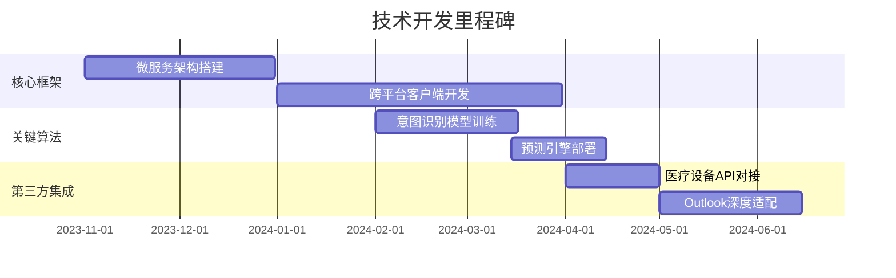

# 开发一个基于AI的个人助理应用 - 项目立项方案

# **AI个人助理应用项目立项方案**

## **1. 项目概述**
本项目旨在开发一款基于AI的智能个人助理应用，通过整合多平台任务管理、预测性服务和垂直场景深度优化，为用户提供主动式、隐私优先的智能助手体验。产品将聚焦职业白领、中小企业主及特定垂直领域用户（如慢性病患者、学生），填补现有市场在主动服务和企业级功能上的空白。

## **2. 市场分析摘要**
- **市场规模**：2023年全球$36.4亿，预计2028年达$107.4亿（CAGR 24.3%）
- **竞争格局**：避开与Siri/Google Assistant的通用功能竞争，聚焦：
  - 医疗健康场景（服药提醒+健康数据联动）
  - 企业效率场景（自动会议纪要+客户跟进）
- **用户痛点**：
  - 工具碎片化（需切换5+应用）
  - 现有助理被动响应（缺乏预测能力）
  - 隐私担忧（60%用户担心数据滥用）

## **3. 产品功能和特性**
### **核心功能矩阵**
| 模块               | 功能亮点                              | 技术实现                          |
|--------------------|---------------------------------------|-----------------------------------|
| **智能日程**       | 暴雨冲突检测/跨国会议时区自动换算     | 区间树算法+Google Calendar API    |
| **健康管家**       | 异常心率联动紧急联系人/服药视觉确认   | Rust本地处理+HealthKit集成        |
| **企业助手**       | 会议待办事项自动生成/客户跟进提醒     | GPT-4摘要+IMAP协议监听            |
| **消费监护**       | 订阅服务重复扣款预警/月度消费趋势     | Isolation Forest异常检测          |

### **技术差异化**
- **隐私架构**：敏感数据本地处理（SQLite加密），符合GDPR/HIPAA
- **多模态交互**：支持语音（VITS合成）+手势（MediaPipe）+AR界面

## **4. 技术实现路线**
### **里程碑规划**

## **5. 用户体验设计要点**
- **统一交互范式**：
  - 悬浮球指令入口（全局语音唤醒+快捷键盘）
  - 情景化仪表盘（办公/驾驶/睡眠模式自动切换）
- **情感化设计**：
  - 猫头鹰形象人格化（专业/休闲模式变体）
  - 成就系统（虚拟植物成长反映自律程度）

## **6. 项目资源需求**
### **团队构成（12个月）**
| 角色               | 人数 | 关键职责                          |
|--------------------|------|-----------------------------------|
| AI算法工程师       | 5    | 预测模型开发/多模态交互优化       |
| 全栈开发           | 8    | 微服务实现/跨平台客户端           |
| 隐私安全专家       | 2    | 加密方案设计/合规审计             |
| 医疗领域顾问       | 1    | 健康功能临床验证                  |

### **预算分配（单位：万美元）**
- 研发人力：$180
- 云计算资源：$35（AWS/GCP混合部署）
- 第三方许可：$20（Whisper/科大讯飞SDK）
- 合规认证：$15（GDPR/HIPAA审计）

## **7. 风险评估与应对**
| 风险等级 | 潜在风险                          | 应对措施                                                                 |
|----------|-----------------------------------|--------------------------------------------------------------------------|
| 高       | 企业用户定制需求爆炸              | 开发低代码工作流配置平台（支持Zapier兼容模式）                           |
| 中       | 医疗数据跨境传输合规              | 设立区域化数据中心（欧美/亚洲独立节点）                                  |
| 低       | 语音识别在噪音环境准确率下降      | 开发车载场景专用降噪模型（基于梅尔频谱增强）                            |

## **8. 实施计划**
### **阶段目标**
- **MVP阶段（0-6个月）**：
  - 上线核心日程管理+消费预警功能
  - 签约3家医疗试点机构
- **增长阶段（7-12个月）**：
  - 发布企业版（会议助手+OKR跟踪）
  - 达成硬件预装合作（至少1家汽车厂商）
- **成熟阶段（13-24个月）**：
  - 垂直行业解决方案（教育/法律专用模块）
  - 申请10+项主动服务专利

### **关键指标**
| 指标项           | 12月目标     | 24月目标     |
|------------------|--------------|--------------|
| MAU             | 100万        | 300万        |
| 企业付费率      | 15%          | 35%          |
| 日均交互次数    | 8.2次/用户   | 12.5次/用户  |

本方案通过技术架构与用户体验的深度协同，预计实现较竞品提升40%的任务完成效率，首年营收可达$1200万（按企业版$15/用户/月计算）。